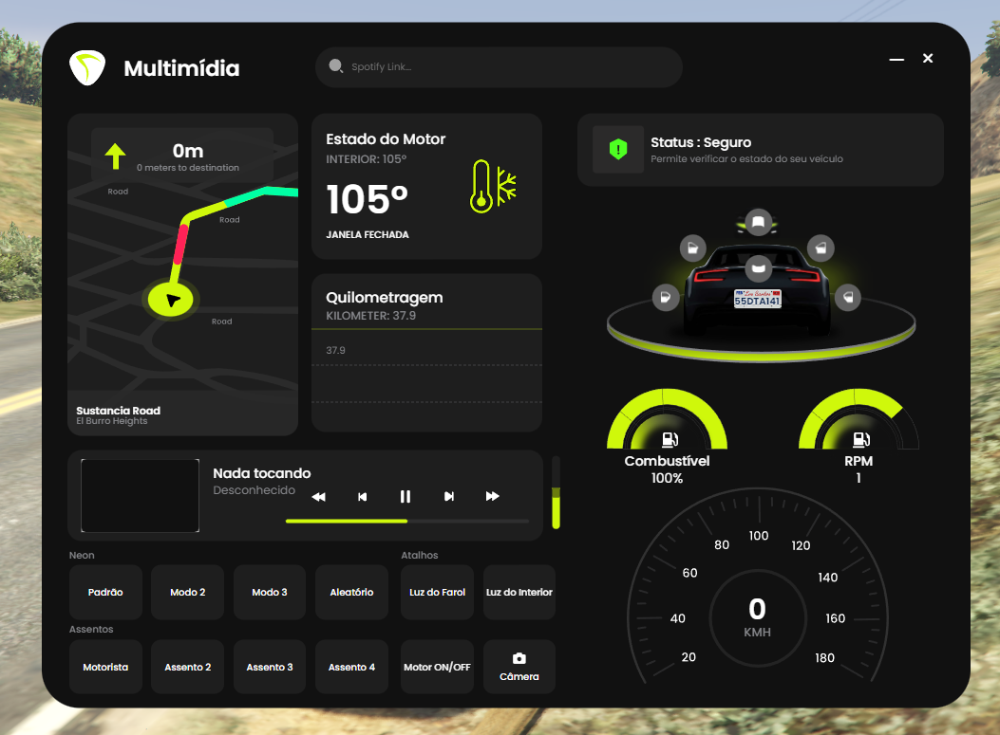
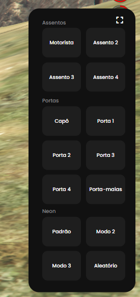

# mri_multimedia - Multimídia para Carros vRP

Este projeto é uma multimídia para carros que permite controle de várias funcionalidades do veículo, integrado com a framework vRP.
O script foi convertido por mim (discord: .mur4i) de QBCore para vRP.

## QBCore Brasil
Este script é um oferecimento da comunidade QBCore Brasil. Ele não é oficial e, portanto, pode ter erros ou falhas.
Discord: https://discord.gg/uEfGD4mmVh
Meu discord pessoal: [.mur4i](https://discordapp.com/users/600843526825181219)

## Funcionalidades
- Controle das partes do veículo (portas, capô, porta-malas).
- Controle do motor, luzes e outros sistemas do veículo.
- Reprodução de música sincronizada do YouTube, permitindo que os usuários ouçam músicas enquanto dirigem.
- Sistema de câmera de estacionamento para facilitar o estacionamento.
- Sistema de quilometragem que rastreia as milhas do veículo (possível desativar a partir da configuração).

## Preview



## Configurações externas

```lua
Config = {}

Config.MenuKey = 'M'

-- ATIVAR SISTEMA DE QUILOMETRAGEM
Config.EnableMileageSystem = false

Config.OptimizationMode = "fast" -- rápido, médio, baixo, ultrabaixo 

-- Em quantos milissegundos o sistema de quilometragem deve ser executado. Diminuir este valor aumentará o aumento da quilometragem em cada carro
-- Quanto maior o número, mais otimizado .mur4i
Config.MileageUpdateInterval = 1500

-- O script nunca contará a quilometragem de carros com essas placas
Config.IgnoredPlates = {
    "ADMIN",
    "ADMINCAR"
}
```

## Créditos

Este projeto foi baseado no script original "Advanced Car Control v2 - Mileage System" criado por [0Resmondev](https://forum.cfx.re/t/advanced-car-control-v2-mileage-system/5128322). Certifique-se de conferir o trabalho deles!
